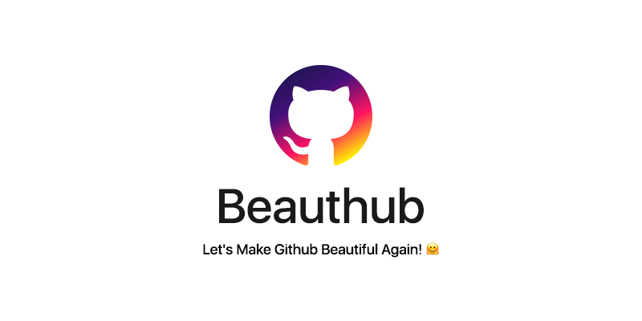

    

    

    <a href="#what-is-it">About</a>
    <strong>&emsp;&bull;&emsp;</strong>
    <a href="#how-to-install">Install</a>
    <strong>&emsp;&bull;&emsp;</strong>
    <a href="#available-themes">Themes</a>
    <strong>&emsp;&bull;&emsp;</strong>
    <a href="#license">License</a>

## What is it?
**Beauthub is an extension that allows you to customize the Github!**

> Inspired by [MakeGithubGreatAgain](https://github.com/DennisSnijder/MakeGithubGreatAgain "MakeGithubGreatAgain")

## How to Install?

* You can install **Beauthub** from the Chrome Store:

* Or you can manually install **Beauthub**:
    * Clone this repo: `$ git clone https://github.com/nof1000/beauthub.git`
    * Open up `chrome://extensions` in your browser and click **Developer Mode** at the top right.
    * Click on the new button **Load unpacked extension...** and select the downloaded folder.

## Available Themes
* Default

---

* Old School

---

* Hacker

---

* Kitty(meow-meow)

## LICENSE
[MIT](./LICENSE "The MIT License")
