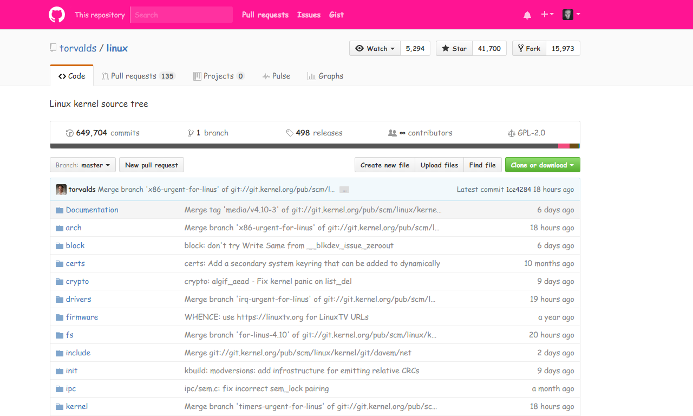

## Let's make Github beautiful Again!

## Install

* Download Repository `$ git clone https://github.com/nof1000/MakeGithubBeautifulAgain.git`
* Open up `chrome://extensions/` in your browser and click “Developer mode” in the top right.
* Click on the new button Load unpacked extension... and select the downloaded folder.

## LICENSE
[MIT](./LICENSE "The MIT License")
